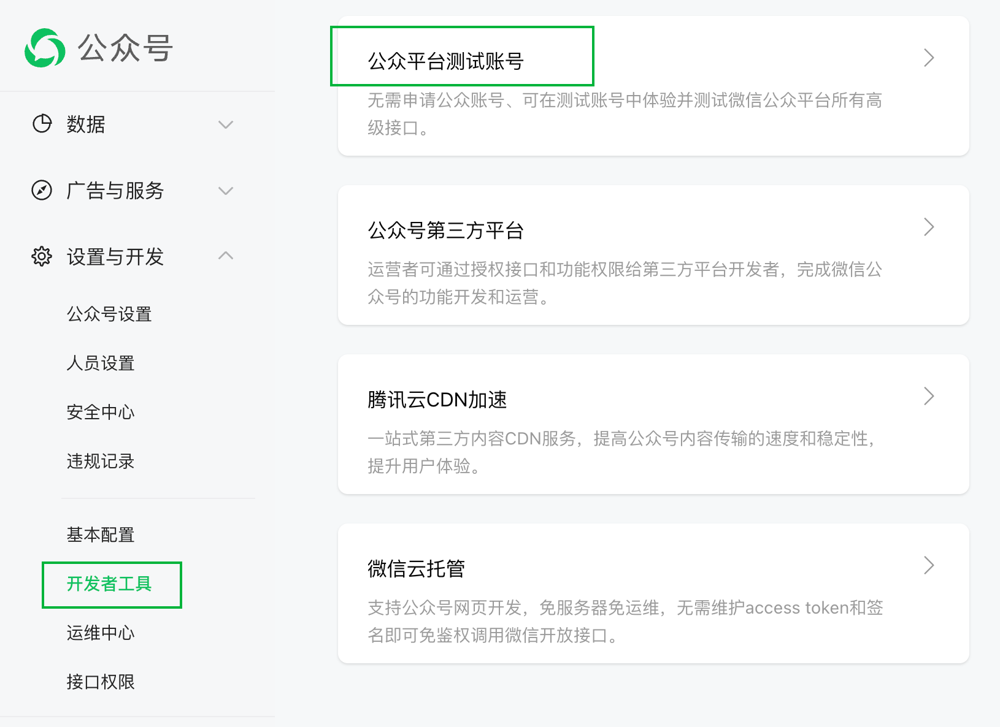

# Berry-Video 树莓拍

> author：方宇杰(后端)  李建君(前端)

2023年 七牛云 1024 创作节校园编程马拉松参赛作品

## 提交材料位置

后端源码：`仓库根目录`

前端源码：`仓库根目录/berry-frontend`

demo演示视频：

- B站链接：https://www.bilibili.com/video/BV1Rj411h7z8/
- 百度云(备用):
  - 链接: https://pan.baidu.com/s/1k2JU6SUWUFbhIWjyDVZrvA?pwd=e1eu
  - 提取码: e1eu

设计文档：`仓库根目录/docs/树莓派设计文档.pdf`

## 如何运行项目

### 1. 准备环境

```
MySQL 8.0
RabbitMQ 3.8.3
Nacos 2.x
ElasticSearch 7.17.0
ElasticSearch Ik-anaylzer
```

### 2. 数据库配置

1. 启动MySQL
2. 导入 `仓库根目录/docs/init.sql` SQL脚本，初始化表结构。
3. 去 `仓库根目录/berry-services/**/application-dev.yml` 修改数据库配置（都打上了`TODO`，可以在idea里查找）

### 3. 微信公众平台配置

1. 去 https://mp.weixin.qq.com/ 注册账号
1. 无须正式号，在后台的 "设置与开发" -> "开发者工具" => "公众平台测试测试账号"，即可领取对应的密钥



3. 获取密钥，将其配置在`berry-misc-service` 下的`application-dev.yaml` 配置下


### 4. RabbitMQ + Redis 配置修改

同MySQL，在`仓库根目录/berry-services/**/application-dev.yml`的配置文件里都有`TODO`标识

### 5. Nacos

版本为 `2.x` 的即可，端口默认，无须修改配置。

### 6. ElasticSearch + IK分词器

要求版本必须为 `7.17.x`，并在其路径的`plugins`里安装 `IK分词器`（IK分词器的版本与ElasticSearch保持一致）

> 停用词表（可选项）

https://github.com/goto456/stopwords

1. 上传 停用词库


2. 修改 IK分词器配置


### 7. 七牛SDK配置修改

修改`berry-misc-service/**/application-dev.yaml`中的配置

```
qiniu:
  oss:
    accessKey: 
    secretKey: 
    bucket: 
    pipeline: 
```

其中pipeline指的是`智能多媒体服务`中的队列


### 8. 前端代理配置

修改文件 `仓库根目录/berry-frontend/vue.config.js`的如下配置：

```
'/api': {
    target: "http://192.168.43.9:10010",
    changeOrigin: true,
    pathRewrite: {
      '^/api': ''
    }
}	
```

修改 `target`的值为 后端Gateway的服务地址

## 启动项目流程

### 1. 后端

保证MySQL、Redis、RabbitMQ服务正常，相关的配置正确。

打开idea，启动
berry-user-service、berry-misc-service、berry-video-service、berry-search-service、berry-search-service、berry-action-service。

最后启动 gateway。

### 2. 前端

进入 berry-frontend 目录，安装依赖

```
npm install --registry=https://registry.npmmirror.com/
```

安装依赖完毕后，运行前端

```
npm run serve
```

访问 `http://localhost:8080` 端口即可访问。